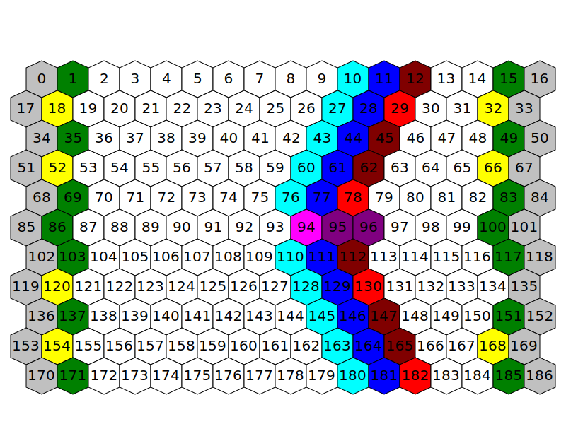

# Battlefield

## Battlefield Layout

Legend:

- gray (0/16/17...): inaccessible hexes located on both sides of the battlefield. Units can't normally move onto them, and they can't be targeted via spells. These hexes are used as back tile for war machines
- green (1/15/35...): starting locations for units. Defined in `config/gameConfig.json`
- yellow (18/32/52...): starting locations for war machines. Defined in `config/gameConfig.json`
- dark red (12/45/62...): non-destroyable parts of walls during siege. Hardcoded.
- light red (29/78/130/182): parts of walls that can be targeted by catapult during siege. Hardcoded
- dark blue (11/28/44...): default position of moat during sieges. Defined in a special spell that is casted on start of siege battle.
- light blue (10/27/43...): additional locations covered by "wide" moat in Fortress. Defined in a special spell that is casted on start of siege battle.
- pink (94): location of drawbridge. Unit located on this tile will block drawbridge and prevent it from opening. In Fortress this hex also acts as moat when drawbridge is raised. Hardcoded
- purple (95/96): gatehouse. Unless drawbridge is down, these tiles can only be entered by defender. When defender unit is on this tile, drawbridge is forced to open. Blocked drawbridge would block these tiles. Hardcoded
- not depicted (12/50/183): locations of towers that can be targeted by catapult. Hardcoded
