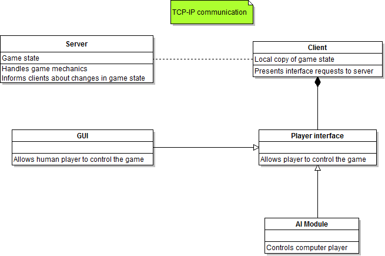

The code of VCMI is divided into several main parts: client, server, lib
and AIs, each one in a separate binary file.

# The big picture

<figure>

<figcaption>Architektura.png</figcaption>
</figure>

VCMI contains three core projects: VCMI_lib (dll / so), VCMI_client
(executable) and VCMI_server (executable). [Server](Server "wikilink")
handles all [game mechanics](game_mechanics "wikilink") and events.
[Client](Client "wikilink") presents [game state](game_state "wikilink")
and events to player and collects input from him.

During the game, we have one (and only one) server and one or more (one
for each player computer) clients.

Important: State of the game and its mechanics are synchronized between
clients and server. All changes to the game state or mechanics must be
done by server which will send appropriate notices to clients.

## Game state

It's basically CGameState class object and everything that's accessible
from it: map (with objects), player statuses, game options, etc.

## Bonus system

One of the more important pieces of VCMI is the [bonus
system](bonus_system "wikilink"). It's described in a separate article.

## Configuration

Most of VCMI configuration files uses Json format and located in
"config" directory

### [Json parser and writer](Json_parser_and_writer "wikilink")

# Client

## Main purposes of client

[Client](Client "wikilink") is responsible for:

-   displaying state of game to human player
-   capturing player's actions and sending requests to server
-   displaying changes in state of game indicated by server

## Rendering of graphics

Rendering of graphics relies heavily on SDL. Currently we do not have
any wrapper for SDL internal structures and most of rendering is about
blitting surfaces using SDL_BlitSurface. We have a few function that
make rendering easier or make specific parts of rendering (like printing
text). They are places in client/SDL_Extensions and client/SDL_Framerate
(the second one contains code responsible for keeping appropriate
framerate, it should work more smart than just SDL_Delay(miliseconds)).
In rendering, Interface object system is quite helpful. Its base is
CIntObject class that is basically a base class for our library of GUI
components and other objects.

### Video player

Located in client/VideoHandler.cpp/.h, have several platform-specific
versions:

-   For 32-bit Windows - using original 32-bit libraries (binkw32.dll,
    smackw32.dll)
-   For \*nix systems - using ffmpeg libraries.
-   Empty player for 64-bit Windows

### [Primitive controls](Primitive_controls "wikilink")

## [Adventure map interface](Adventure_map_interface "wikilink")

TBD

## [Town interface](Town_interface "wikilink")

TBD

## [Battle interface](Battle_interface "wikilink")

# Server

## Main purposes of server

[Server](Server "wikilink") is responsible for:

-   maintaining state of the game
-   handling requests from all clients participating in game
-   informing all clients about changes in state of the game that are
    visible to them

# Lib

## Main purposes of lib

VCMI_Lib is a library that contains code common to server and client, so
we avoid it's duplication. Important: the library code is common for
client and server and used by them, but the library instance (in
opposition to the library as file) is not shared by them! Both client
and server create their own "copies" of lib with all its class
instances.

iOS platform pioneered single process build, where server is a static
library and not a dedicated executable. For that to work, the lib had to
be wrapped into special namespace that is defined by client and server
targets on iOS, so that single process is able to contain 2 versions of
the library. To make it more convenient, a few macros were introduced
that can be found in
[Global.h](https://github.com/vcmi/vcmi/blob/develop/Global.h). The most
important ones are `VCMI_LIB_NAMESPACE_BEGIN` and
`VCMI_LIB_NAMESPACE_END` which must be used anywhere a symbol from the
lib is needed, otherwise building iOS (or any other platform that would
use single process approach) fails. See [#Wrapped namespace
examples](#Wrapped_namespace_examples "wikilink").

[Lib](Lib "wikilink") contains code responsible for:

-   handling most of Heroes III files (.lod, .txt setting files)
-   storing information common to server and client like state of the
    game
-   managing armies, buildings, artifacts, spells, bonuses and other
    game objects
-   handling general game mechanics and related actions (only adventure
    map objects; it's an unwanted remnant of past development - all game
    mechanics should be handled by the server)
-   networking and serialization

### [Serialization](Serialization "wikilink")

The serialization framework can serialize basic types, several standard
containers among smart pointers and custom objects. Its design is based
on the [boost serialization
libraries](http://www.boost.org/doc/libs/1_52_0/libs/serialization/doc/index.html).
In addition to the basic functionality it provides light-weight transfer
of CGObjectInstance objects by sending only the index/id.

See the [Serialization](Serialization "wikilink") page for all the
details.

### Wrapped namespace examples

#### Inside the lib

Both header and implementation of a new class inside the lib should have
the following structure:

`<includes>`  
`VCMI_LIB_NAMESPACE_BEGIN`  
`<code>`  
`VCMI_LIB_NAMESPACE_END`

Example:
[header](https://github.com/vcmi/vcmi/blob/develop/lib/CBuildingHandler.h)
and
[implementation](https://github.com/vcmi/vcmi/blob/develop/lib/CBuildingHandler.cpp)

#### Headers outside the lib

Forward declarations of the lib in headers of other parts of the project
need to be wrapped in the macros:

`<includes>`  
`VCMI_LIB_NAMESPACE_BEGIN`  
`<lib forward declarations>`  
`VCMI_LIB_NAMESPACE_END`  
`<other forward declarations>`  
`<classes>`

Example:
<https://github.com/vcmi/vcmi/blob/develop/server/CGameHandler.h>

#### New project part

If you're creating new project part, place `VCMI_LIB_USING_NAMESPACE` in
its `StdInc.h` to be able to use lib classes without explicit namespace
in implementation files. Example:
<https://github.com/vcmi/vcmi/blob/develop/launcher/StdInc.h>

# [Artificial Intelligence](Artificial_Intelligence "wikilink") (AI)

## [StupidAI](StupidAI "wikilink")

Stupid AI is recent and used battle AI.

## [Adventure AI](Adventure_AI "wikilink")

VCAI module is currently developed agent-based system driven by goals
and heroes.

## [Programming challenge](Programming_challenge "wikilink")

## [Fuzzy logic](Fuzzy_logic "wikilink")

VCMI includes [FuzzyLite](http://code.google.com/p/fuzzy-lite/) library
to make use of fuzzy rule-based algorithms. They are useful to handle
uncertanity and resemble human behaviour who takes decisions based on
rough observations. FuzzyLite is linked as separate static library in
AI/FuzzyLite.lib file.

# [Utilities](Utilities "wikilink")

## [Launcher](Launcher "wikilink")

## [Duels](Duels "wikilink")

[Mod system proposal](Mod_system_proposal "wikilink")

## [ERM parser](ERM_parser "wikilink")