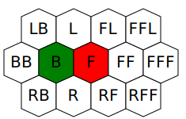
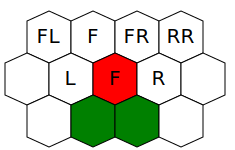

# Bonus Types

The bonuses were grouped according to their original purpose. The bonus system allows them to propagate freely between the nodes, however they may not be recognized properly beyond the scope of original use.

## General-purpose bonuses

### NONE

Bonus placeholder that gives no effect

### MORALE

Changes morale of affected units

- val: change in morale, eg. 1, -2

### LUCK

Changes luck of affected units

- val: change in luck

### MAGIC_SCHOOL_SKILL

Changes mastery level of spells of affected heroes and units. Examples are magic plains terrain and magic school secondary skills

- subtype: school of magic
- val: level

## Player bonuses

Intended to be setup as global effect, AI cheat etc.

### RESOURCES_CONSTANT_BOOST

Bonus that does not account for propagation and gives specific amount of extra resources per day

- subtype: resource identifier
- val: - resource amount

### RESOURCES_TOWN_MULTIPLYING_BOOST

Bonus that does not account for propagation and gives extra resources per day with amount multiplied by number of owned towns

- subtype: resource identifier
- val: - base resource amount to be multiplied times number of owned towns

## Hero bonuses

### MOVEMENT

Increases amount of movement points available to affected hero on new turn

- subtype:
  - heroMovementLand: only land movement will be affected
  - heroMovementSea: only sea movement will be affected
- val: number of movement points (100 points for a tile)

### WATER_WALKING

Allows movement over water for affected heroes

- val: Penalty to movement, in percent (Basic Water Walk - 40, Advanced Water Walk - 20)

### FLYING_MOVEMENT

Allows flying movement for affected heroes

- val: Penalty to movement, in percent

### NO_TERRAIN_PENALTY

Eliminates terrain penalty on certain terrain types for affected heroes (Nomads ability).

Note: to eliminate all terrain penalties see [ROUGH_TERRAIN_DISCOUNT](#rough_terrain_discount) bonus

- subtype: type of terrain, eg `sand`

### TERRAIN_NATIVE

Affected units will view any terrain as native. This means army containing these creature will have no movement penalty, and will be able to see Mines and Quick Sand in battle.

### PRIMARY_SKILL

Changes selected primary skill for affected heroes and units

- subtype: primary skill
- addInfo: 1 - only for melee attacks, 2 - only for ranged attacks

### SIGHT_RADIUS

Reveal area of fog of war around affected heroes when hero is recruited or moves

- val: radius in tiles

### DARKNESS

On each turn, hides area in fog of war around affected objects for all players other than town owner. Areas within scouting range of owned objects are not affected

NOTE: when used by heroes, effect would still activate only on new turn, and not on every hero movement

- val: radius in tiles
- addInfo: optional, activation period (e.g. 7 = weekly, 28 = monthly)

### FULL_MAP_SCOUTING

On each turn, reveals entire map for owner of the bonus

- addInfo: optional, activation period (e.g. 7 = weekly, 28 = monthly)

### FULL_MAP_DARKNESS

On each turn, hides entire map in fog of war for all players other than town owner. Areas within scouting range of owned objects are not affected

- addInfo: optional, activation period (e.g. 7 = weekly, 28 = monthly)

### MANA_REGENERATION

Restores specific amount of mana points for affected heroes on new turn

- val: amount of spell points to restore

### MANA_PERCENTAGE_REGENERATION

Restores specific percentage of mana pool for affected heroes on new turn. If hero has both MANA_REGENERATION and MANA_PERCENTAGE_REGENERATION, only bonus that gives more mana points will be active

- val: percentage of spell points to restore

### SKELETON_TRANSFORMER_TARGET

Unit affected by this bonus will be transformed into creature other than Skeleton when placed into Skeleton Transformer

- subtype: type of creature to which this unit should be converted

### NONEVIL_ALIGNMENT_MIX

Allows mixing of creaturs of neutral and good factions in affected armies without penalty to morale (Angelic Alliance effect)

### SURRENDER_DISCOUNT

Changes surrender cost for affected heroes

- val: decrease in cost, in percentage

### IMPROVED_NECROMANCY

Bonus allows the hero to raise specific creatures from corpses after battle.

If the hero has multiple bonuses of the same type, the game will select the unit with the higher level. If the units have the same level, the game will select the unit with the higher market value (the total cost of the unit in gold, including converted resources).

If the hero has no free space for the target creature but has space for its upgrade (including subsequent upgrades), the upgraded unit will be raised instead at a rate of two-thirds.

- subtype: creature raised
- val: Necromancer power
- addInfo: Requried total level of Necromancer power for this bonus to be active (val of all bonuses of this type)

Example (from Cloak Of The Undead King):

```json
{
    "type" : "IMPROVED_NECROMANCY",
    "subtype" : "creature.walkingDead",
    "addInfo" : 1, // requires 1 val of IMPROVED_NECROMANCY from other source, e.g. skill
    "val" : 0 // does not provides levels of necromancer power on its own
}
```

### LEARN_BATTLE_SPELL_CHANCE

Determines chance for affected heroes to learn spell cast by enemy hero after battle

- val: chance to learn spell, percentage

### LEARN_BATTLE_SPELL_LEVEL_LIMIT

Allows affected heroes to learn spell cast by enemy hero after battle

- val: maximal level of spell that can be learned

### LEARN_MEETING_SPELL_LIMIT

Allows affected heroes to learn spells from each other during hero exchange

- val: maximal level of spell that can be learned

### ROUGH_TERRAIN_DISCOUNT

Reduces movement point penalty when moving on terrain with movement cost higher than base movement cost Cannot reduce movement cost lower than base movement cost. See the `movementCostBase` parameter in the game config and the `BASE_TILE_MOVEMENT_COST` bonus type. Used for the Pathfinding skill

- val: penalty reduction, in movement points per tile.

### BASE_TILE_MOVEMENT_COST

Change the minimum cost required to move from one tile to another while off-road by the specified value. Has no effect on road movement. Used for pathfinding in HotA

- val: positive value increases the minimum cost, negative value decreases it.

### WANDERING_CREATURES_JOIN_BONUS

Increases probability for wandering monsters to join army of affected heroes

- val: change in disposition factor when calculating join chance

### BEFORE_BATTLE_REPOSITION

Allows affected heroes to position army before start of battle (Tactics)

- val: distance within which hero can reposition his troops

### BEFORE_BATTLE_REPOSITION_BLOCK

Reduces distance in which enemy hero can reposition. Counters [BEFORE_BATTLE_REPOSITION](#before_battle_reposition) bonus

- val: distance within which hero can reposition his troops

### HERO_EXPERIENCE_GAIN_PERCENT

Increases experience gain from all sources by affected heroes

- val: additional experience bonus, percentage

### STACK_EXPERIENCE_GAIN_PERCENT

Increases experience gain from combat by affected units. No effect if stack experience is off. Has no effect on commanders

- val: additional experience bonus, percentage

### UNDEAD_RAISE_PERCENTAGE

Defines percentage of enemy troops that will be raised after battle into own army (Necromancy). Raised unit is determined by [IMPROVED_NECROMANCY](#improved_necromancy) bonus

- val: percentage of raised troops

### MANA_PER_KNOWLEDGE_PERCENTAGE

Defines percentage of mana points that hero gains per each point of knowledge (Intelligence)

- val: percentage of mana points per knowledge

### HERO_GRANTS_ATTACKS

Gives additional attacks to specific creatures in affected army (Artillery)

- subtype: creature to give additional attacks
- val: number of attacks

### BONUS_DAMAGE_CHANCE

Gives specific creature in affected army chance to deal additional damage (Artillery)

- subtype: creature to give additional damage chance
- val: chance to deal additional damage, percentage

### BONUS_DAMAGE_PERCENTAGE

Defines additional damage dealt for creatures affected by BONUS_DAMAGE_CHANCE bonus (Artillery)

- subtype: creature to give additional damage percentage
- val: bonus damage, percentage

### MAX_LEARNABLE_SPELL_LEVEL

Defines maximum level of spells than hero can learn from any source (Wisdom)

- val: maximal level to learn

### COMBAT_MANA_BONUS

Grants affected hero additional mana for the duration of combat. Bonus may give total mana above mana limit. Any additional mana not spent during combat will be lost.

- val: amount of additional mana

## Hero specialties

### SPECIAL_SPELL_LEV

Gives additional bonus to effect of specific spell based on level of creature it is cast on

- subtype: identifier of affected spell
- val: bonus to spell effect, percentage, divided by target creature level

### SPELL_DAMAGE

Gives additional bonus to effect of all spells of selected school

- subtype: affected spell school
- val: spell effect bonus, percentage

### SPECIFIC_SPELL_DAMAGE

For `damage`, `heal` and `demonSummon` spell effects, increases spell power by specific percentage

- subtype: identifier of affected spell
- val: bonus to spell effect, percentage

### SPECIAL_PECULIAR_ENCHANT

Gives creature under effect of this spell additional bonus, which is hardcoded and depends on the creature tier.

- subtype: affected spell identifier, ie. `spell.haste`
- addInfo: must be set to 0, or 1 for Slayer specialty

### SPECIAL_ADD_VALUE_ENCHANT

Modifies 'val' parameter of spell effects that give bonuses by specified value. For example, Aenain makes Disrupting Ray decrease target's defense by additional 2 points:

```json
"disruptingRay" : {
    "addInfo" : -2,
    "subtype" : "spell.disruptingRay",
    "type" : "SPECIAL_ADD_VALUE_ENCHANT"
}
```

- subtype: affected spell identifier
- addInfo: value to modify 'val' parameter of targeted spell effects by

### SPECIAL_FIXED_VALUE_ENCHANT

Changes 'val' parameter of spell effects that give bonuses to a specified value. For example, Fortune cast by Melody always modifies luck by +3:

```json
"fortune" : {
    "addInfo" : 3,
    "subtype" : "spell.fortune",
    "type" : "SPECIAL_FIXED_VALUE_ENCHANT"
}
```

- subtype: affected spell identifier
- addInfo: value to set 'val' parameter of targeted spell effects to

### SPECIAL_UPGRADE

Allows creature being upgraded to another creature (Gelu, Dracon)

- subtype: identifier of creature that can being upgraded
- addInfo: identifier of creature to which perform an upgrade

## Artifact bonuses

### SPELL_DURATION

Changes duration of timed spells cast by affected hero

- val: additional duration, turns
- subtype: optional, identifier of affected spells, or all if not set

### SPELL

Allows affected heroes to cast specified spell, even if this spell is banned in map options or set to "special".

- subtype: spell identifier
- val: skill level mastery (0 - 3)

### SPELLS_OF_LEVEL

Allows affected heroes to cast any spell of specified level. Does not grant spells banned in map options.

- subtype: spell level, in form "spellLevelX" where X is desired level (1-5)

### SPELLS_OF_SCHOOL

Allows affected heroes to cast any spell of specified school. Does not grant spells banned in map options.

- subtype: spell school

### GENERATE_RESOURCE

Affected heroes will add specified resources amounts to player treasure on new day

- subtype: resource identifier
- val: additional daily income

### CREATURE_GROWTH

Increases weekly growth of creatures in affected towns (Legion artifacts)

- val: number of additional weekly creatures
- subtype: dwelling level, in form `creatureLevelX` where X is desired level (1-7)

### CREATURE_GROWTH_PERCENT

Increases weekly growth of creatures in affected towns (Statue of Legion)

- val: additional growth, percentage

### BATTLE_NO_FLEEING

Heroes affected by this bonus can not retreat or surrender in battle (Shackles of War effect)

### NEGATE_ALL_NATURAL_IMMUNITIES

Negates all natural immunities for affected stacks. (Orb of Vulnerability)

- subtype:
  - immunityBattleWide: Entire battle will be affected by bonus
  - immunityEnemyHero: Only enemy hero will be affected by bonus

### OPENING_BATTLE_SPELL

In battle, army affected by this bonus will cast spell at the very start of the battle. Spell is always cast at expert level.

- subtype: spell identifier
- val: duration of the spell, in rounds

### FREE_SHIP_BOARDING

Heroes affected by this bonus will not lose all movement points when embarking or disembarking ship. Movement points are converted depending on max land and water movement range.

### WHIRLPOOL_PROTECTION

Heroes affected by this bonus won't lose army when moving through whirlpool

## Creature bonuses

### STACK_HEALTH

Increases maximum hit point of affected units

- val: additional hit points to gain

### STACKS_SPEED

Increases movement speed of units in battle

- val: additional movement speed points

### CREATURE_DAMAGE

Increases base damage of creature in battle

- subtype:
  - creatureDamageMin: increases only minimal damage
  - creatureDamageMax: increases only maximal damage
  - creatureDamageBoth: increases both minimal and maximal damage
- val: additional damage points

### SHOTS

Increases starting amount of shots that unit has in battle

- val: additional shots

## Creature abilities

## Creature Natures

### LIVING

Affected unit is considered to be alive. Automatically granted to any unit that does not have any other creature nature bonus

Living units can be affected by TRANSMUTATION, LIFE_DRAIN, and SOUL_STEAL bonuses

### NON_LIVING

Creature nature bonus. Affected unit is considered to not be alive and not affected by morale and certain spells

### MECHANICAL

Creature nature bonus. Affected unit is considered to not be alive and not affected by morale and certain spells but should be repairable from engineers (HotA Factory).

### GARGOYLE

Creature nature bonus. Affected unit is considered to be a gargoyle and not affected by certain spells

### UNDEAD

Creature nature bonus. Affected unit is considered to be undead, which makes it immune to many effects, not affected by morale, and also reduce morale of allied living units.

### SIEGE_WEAPON

Creature nature bonus. Affected unit is considered to be a siege machine and can not be raised, healed, have morale or move. All War Machines should have this bonus.

## Static abilities and immunities

### DRAGON_NATURE

Affected unit is dragon. This bonus provides no effects on its own, but is used as limiter for Mutare specialty

### KING

Affected unit will take more damage from units under Slayer spell effect

- val: required skill mastery of Slayer spell to affect this unit

### NO_LUCK

Affected units can not receive good or bad luck

### NO_MORALE

Affected units can not receive good or bad morale

## Combat abilities

### FLYING

Affected unit can fly on the battlefield

- subtype:
  - movementFlying: creature will fly (slowly move across battlefield)
  - movementTeleporting: creature will instantly teleport to destination, skipping movement animation.

### SHOOTER

Affected unit can shoot

### CHARGE_IMMUNITY

Affected unit is immune to JOUSTING ability of (ie. Champions).

### ADDITIONAL_ATTACK

Affected unit can perform additional attacks. Attacked unit will retaliate after each attack if able.

- val: number of additional attacks to perform

### UNLIMITED_RETALIATIONS

Affected unit will always retaliate if able (Royal Griffin)

### ADDITIONAL_RETALIATION

Affected unit can retaliate multiple times per turn (basic Griffin)

- val: number of additional retaliations

### JOUSTING

Affected unit will deal more damage based on movement distance (Champions)

- val: additional damage per passed tile, percentage

### VULNERABLE_FROM_BACK

When affected unit is attacked from behind, it will receive more damage when attacked and will not turn around to face the attacker

- val: additional damage for attacks from behind, percentage (0-100)

### HATE

Affected unit will deal more damage when attacking specific creature

- subtype - identifier of hated creature, ie. "creature.genie"
- val - additional damage, percentage

### SPELL_LIKE_ATTACK

Affected unit ranged attack will use animation and range of specified spell (Magog, Lich)

- subtype: spell identifier
- val: spell mastery level

### ATTACKS_ALL_ADJACENT

The affected unit attacks all adjacent units (Hydra). Only the unit that has been directly targeted will attempt to retaliate. If the unit is hypnotised, it will attack its former allies instead.

### THREE_HEADED_ATTACK

The affected unit will attack units located on the hexed to the left and right of the targeted tile (Cerberus). Only the unit that has been directly targeted will attempt to retaliate.
Potentially deprecated. Consider using the more flexible [MULTIHEX_ENEMY_ATTACK](#multihex_unit_attack) instead with custom icon and description.

### TWO_HEX_ATTACK_BREATH

The affected unit will also attack the hex located directly behind the targeted hex (Dragons). Only the unit that has been directly targeted will attempt to retaliate.
Potentially deprecated. Consider using the more flexible [MULTIHEX_UNIT_ATTACK](#multihex_unit_attack) instead with custom icon and description.

### WIDE_BREATH

The affected unit will attack any units in the hexes surrounding the attacked hex.
Deprecated. Please use [MULTIHEX_UNIT_ATTACK](#multihex_unit_attack) instead with custom icon and description.

### PRISM_HEX_ATTACK_BREATH

Similar to `TWO_HEX_ATTACK_BREATH`, but affecting two additional hexes in a triangular formation from the target hex.
Deprecated. Please use [MULTIHEX_UNIT_ATTACK](#multihex_unit_attack) instead with custom icon and description.

### MULTIHEX_UNIT_ATTACK

The affected unit attacks all units, friendly or not, located on specified hexes in addition to the primary target. Only the unit that has been directly targeted will attempt to retaliate.

- addInfo: A list of strings describing which hexes this unit will attack, computed from the attacker's position. The possible values are: `F` (front), `L` (left), `R` (right), `B` (back). See below for more examples.

Examples:

- H3 Dragon Breath: `[ "FF" ]` – dragons also attack the hex located two hexes in front of the dragon's head.
- H3 Cerberus three-headed attack: `[ "L", "R" ]` - Cerberus also attacks the hexes one hex to the left and right of itself.
- Prism Breath (mods): `[ "FL", "FF", "FR" ]` — a more powerful version of Dragon Breath; all units behind the target are attacked.

This is how all tiles can be referenced in the event of a frontal attack (green is the attacker and red is the defender). The hex on which defender is located is always included unconditionally.



In the case of a double-wide unit that can attack hexes to the left and right (e.g. Cerberi), the left or right hex may end up inside the attacker in certain attack configurations. To avoid this, the hex that ends up inside the unit will be 'pushed' one hex forward. This does not affect single-wide units. See below for reference:



### MULTIHEX_ENEMY_ATTACK

The affected unit will attack all enemies located on the specified hexes, in addition to its primary target. Only the unit that has been directly targeted will attempt to retaliate. If the unit is hypnotised, it will attack its former allies instead.

- addInfo: see [MULTIHEX_UNIT_ATTACK](#multihex_unit_attack) for a detailed description.

### MULTIHEX_ANIMATION

The bonus does not affect the mechanics. If the affected unit hits any non-primary targets located on the specified tiles, the unit will play an alternative attack animation if one is present.

If this bonus is not present, the unit will always use the alternative attack animation whenever its attack hits any unit other than the primary target.

- addInfo: see [MULTIHEX_UNIT_ATTACK](#multihex_unit_attack) for a detailed description.

### RETURN_AFTER_STRIKE

Affected unit can return to his starting location after attack (Harpies)

### ENEMY_DEFENCE_REDUCTION

Affected unit will ignore specified percentage of attacked unit defense (Behemoth)

- val: amount of defense points to ignore, percentage

### GENERAL_DAMAGE_REDUCTION

Affected units will receive reduced damage from attacks by other units

- val: damage reduction, percentage
- subtype:
  - damageTypeMelee: only melee damage will be reduced
  - damageTypeRanged: only ranged damage will be reduced
  - damageTypeAll: all damage will be reduced

### PERCENTAGE_DAMAGE_BOOST

Affected units will deal increased damage when attacking other units

- val: damage increase, percentage
- subtype:
  - damageTypeMelee: only melee damage will increased
  - damageTypeRanged: only ranged damage will increased

### GENERAL_ATTACK_REDUCTION

Affected units will deal reduced damage when attacking other units (Blind or Paralyze spells)

- val: damage reduction, percentage

### DEFENSIVE_STANCE

Affected units will receive increased bonus to defense while defending

- val: additional bonus to defense, in skill points

### NO_DISTANCE_PENALTY

Affected unit will have no distance penalty when shooting. Does not negates wall penalties in sieges

### NO_MELEE_PENALTY

Affected ranged unit will deal full damage in melee attacks

### NO_WALL_PENALTY

Affected unit will deal full damage when shooting over walls in sieges. Does not negates distance penalty

### FREE_SHOOTING

Affected unit can use ranged attack even when blocked by enemy unit, like with Bow of the Sharpshooter relic

### BLOCKS_RETALIATION

Affected unit will never receive retaliations when attacking

### SOUL_STEAL

Affected unit will gain new creatures for each enemy killed by this unit

- val: number of units gained per enemy killed
- subtype:
  - soulStealPermanent: creature will stay after the battle
  - soulStealBattle: creature will be lost after the battle

### TRANSMUTATION

Affected units have chance to transform attacked, living unit to other creature type, unless attacked unit is under TRANSMUTATION_IMMUNITY bonus

- val: chance for ability to trigger, percentage
- subtype:
  - transmutationPerHealth: transformed unit will have same HP pool as original stack,
  - transmutationPerUnit: transformed unit will have same number of units as original stack
- addInfo: creature to transform to. If not set, creature will transform to same unit as attacker

### TRANSMUTATION_IMMUNITY

Affected unit is immune to TRANSMUTATION bonus effects

### SUMMON_GUARDIANS

When battle starts, affected units will be surrounded from all side with summoned units

- val: amount of units to summon, per stack, percentage of summoner stack size
- subtype: identifier of creature to summon

### RANGED_RETALIATION

Affected units will retaliate against ranged attacks, if able

### BLOCKS_RANGED_RETALIATION

Affected unit will never receive counterattack in ranged attacks. Counters RANGED_RETALIATION bonus

### FIRST_STRIKE

Affected unit will retaliate before enemy attacks, if able

- subtype:
  - damageTypeMelee: only melee attacks affected
  - damageTypeRanged: only ranged attacks affected. Note that unit also requires ability to retaliate in ranged, such as RANGED_RETALIATION bonus
  - damageTypeAll: any attacks are affected

### SHOOTS_ALL_ADJACENT

Affected unit will attack units on all hexes that surround attacked hex in ranged attacks

### DESTRUCTION

Affected unit will kills additional units after attack

- val: chance to trigger, percentage
- subtype:
  - destructionKillPercentage: kill percentage of units,
  - destructionKillAmount: kill amount
- addInfo: amount or percentage to kill

### LIMITED_SHOOTING_RANGE

Affected unit can use ranged attacks only within specified range

- val: max shooting range in hexes
- addInfo: optional, range at which ranged penalty will trigger (default is 10)

### FEROCITY

Affected unit will attack additional times if killed creatures in target unit during attacking (including ADDITIONAL_ATTACK bonus attacks)

- val: amount of additional attacks (negative number will reduce number of unperformed attacks if any left)
- addInfo: optional, amount of creatures needed to kill (default is 1)

### ENEMY_ATTACK_REDUCTION

Affected unit will ignore specified percentage of attacked unit attack (Nix)

- val: amount of attack points to ignore, percentage

### REVENGE

Affected unit will deal more damage based on percentage of self health lost compared to amount on start of battle
(formula: `square_root((total_unit_count + 1) * 1_creature_max_health / (current_whole_unit_health + 1_creature_max_health) - 1)`.
Result is then multiplied separately by min and max base damage of unit and result is additive bonus to total damage at end of calculation)

## Special abilities

### CATAPULT

Affected unit can attack walls during siege battles (Cyclops)

- subtype: spell that describes attack parameters

### CATAPULT_EXTRA_SHOTS

Defines spell mastery level for spell used by CATAPULT bonus

- subtype: affected spell
- val: spell mastery level to use

### MANUAL_CONTROL

Hero can control war machine affected by this bonus

- subtype: creature identifier of affected war machine
- val: chance to control unit, percentage

### CHANGES_SPELL_COST_FOR_ALLY

Affected units will decrease spell cost for their hero (Mage). If multiple units have this bonus only best value will be used

- val: reduction in mana points.

### CHANGES_SPELL_COST_FOR_ENEMY

Affected units will increase spell cost for enemy hero (Silver Pegasus). If multiple units have this bonus only best value will be used

- val: increase in mana points.

### SPELL_RESISTANCE_AURA

All units adjacent to affected unit will receive additional spell resistance bonus. If multiple adjacent units have this bonus only best value will be used

- val: additional resistance bonus, percentage

### HP_REGENERATION

Affected unit will regenerate portion of its health points on its turn.

- val: amount of health points gained per round

### MANA_DRAIN

Affected unit will drain specified amount of mana points from enemy hero on each turn

val: spell points per turn to take

### MANA_CHANNELING

Affected unit will give his hero specified portion of mana points spent by enemy hero

- val: spell points to give, percentage

### LIFE_DRAIN

Affected unit will heal itself, resurrecting any dead units, by amount of dealt damage (Vampire Lord)

- val: percentage of damage that will be converted into health points

### DOUBLE_DAMAGE_CHANCE

Affected unit has chance to deal double damage on attack (Death Knight)

- val: chance to trigger, percentage

### FEARFUL

Affected unit has chance to freeze in fear and entirely skip its turn (Azure Dragons)

- val: chance for the unit to freeze in fear

### HEALER

Affected unit acts as healing tent and can heal allied units on each turn

- subtype: identifier of spell that will be used for healing action

### FIRE_SHIELD

When affected unit is attacked, portion of received damage will be also dealt to the attacked. Units immune to fire magic will not receive this damage. Only melee attacks will trigger this bonus

- val: amount to deal in return, percentage

### MAGIC_MIRROR

If affected unit is targeted by a spell it will reflect spell to a random enemy unit

- val: chance to trigger, percentage

### ACID_BREATH

Affected unit will deal additional damage after attack

- val - additional damage to deal, multiplied by unit stack size
- addInfo: chance to trigger, percentage

### DEATH_STARE

Affected unit will kill additional units after attack. Used for Death stare (Mighty Gorgon) ability and for Accurate Shot (Pirates, HotA)

- subtype:
  - deathStareGorgon: only melee attack, random amount of killed units
  - deathStareNoRangePenalty: only ranged attacks without obstacle (walls) or range penalty
  - deathStareRangePenalty: only ranged attacks with range penalty
  - deathStareObstaclePenalty: only ranged attacks with obstacle (walls) penalty
  - deathStareRangeObstaclePenalty: only ranged attacks with both range and obstacle penalty
  - deathStareCommander: fixed amount, both melee and ranged attacks
- val:
  - for deathStareCommander: number of creatures to kill, total amount of killed creatures is (attacker level / defender level) \* val
  - for all other subtypes: chance to kill, counted separately for each unit in attacking stack, percentage. At most (stack size \* chance) units can be killed at once, rounded up
- addInfo:
  - SpellID to be used as hit effect. If not set - 'deathStare' spell will be used. If set to "accurateShot" battle log messages will use alternative description

### SPECIAL_CRYSTAL_GENERATION

If player has affected unit under his control in any army, he will receive additional 3 crystals on new week (Crystal Dragons)

### NO_SPELLCAST_BY_DEFAULT

Affected unit will not use spellcast as default attack option

## Creature spellcasting and activated abilities

### SPELLCASTER

Affected units can cast a spell as targeted action (Archangel, Faerie Dragon). Use CASTS bonus to specify how many times per combat creature can use spellcasting. Use SPECIFIC_SPELL_POWER, CREATURE_SPELL_POWER or CREATURE_ENCHANT_POWER bonuses to set spell power. SPECIFIC_SPELL_RANGE bonus can be used to limit range of spell.

- subtype: spell identifier
- val: spell mastery level
- addInfo: weighted chance to select this spell. Can be omitted for always available spells

### ENCHANTER

Affected unit will cast specified spell before his turn (Enchanter)

- val - spell mastery level
- subtype - spell identifier
- addInfo - cooldown before next cast, in number of turns

### RANDOM_SPELLCASTER

Affected unit can cast randomly selected beneficial spell on its turn (Master Genie)

- val - spell mastery level

### CASTS

Determines how many times per combat affected creature can cast its targeted spell

- val: number of casts available per combat

### SPELL_AFTER_ATTACK

- subtype - spell id, eg. spell.iceBolt
- val - chance (percent)
- addInfo - \[X, Y, Z\]
  - X - spell mastery level (1 - Basic, 3 - Expert)
  - Y = 0 - all attacks, 1 - shot only, 2 - melee only
  - Z (optional) - layer for multiple SPELL_AFTER_ATTACK bonuses and multi-turn casting. Empty or value less than 0 = not participating in layering.
  When enabled - spells from specific layer will not be cast until target has all spells from previous layer on him. Spell from last layer is on repeat if none of spells on lower layers expired.

### SPELL_BEFORE_ATTACK

- subtype - spell id
- val - chance %
- addInfo - \[X, Y, Z\]
  - X - spell mastery level (1 - Basic, 3 - Expert)
  - Y = 0 - all attacks, 1 - shot only, 2 - melee only
  - Z (optional) - layer for multiple SPELL_BEFORE_ATTACK bonuses and multi-turn casting. Empty or value less than 0 = not participating in layering.
  When enabled - spells from specific layer will not be cast until target has all spells from previous layer on him. Spell from last layer is on repeat if none of spells on lower layers expired.

### SPECIFIC_SPELL_POWER

- value: Used for Thunderbolt and Resurrection cast by units (multiplied by stack size). Also used for Healing secondary skill (for core:spell.firstAid used by First Aid tent)
- subtype - spell id

### SPECIFIC_SPELL_RANGE

- value: Can be used to limit range of spells casted by creatures.
- subtype - spell id

### CREATURE_SPELL_POWER

- value: Spell Power of offensive spell cast unit, multiplied by 100. ie. Faerie Dragons have value fo 500, which gives them 5 Spell Power for each unit in the stack.

### CREATURE_ENCHANT_POWER

- val: Total duration of spells cast by creature, in turns

### REBIRTH

Affected stack will resurrect after death

- val - percent of total stack HP restored, not rounded. For instance, when 4 Phoenixes with Rebirth chance of 20% die, there is 80% chance than one Phoenix will rise.
- subtype:
  - rebirthRegular: Phoenix, as described above.
  - rebirthSpecial: At least one unit will always rise (Sacred Phoenix)

### ENCHANTED

Affected unit is permanently enchanted with a spell, that is cast again every turn

- subtype: spell identifier
- val: spell mastery level. If above 3, then spell has mass effect with mastery level of (val-3)

## Spell immunities

### LEVEL_SPELL_IMMUNITY

Affected unit is immune to all spell with level below or equal to value of this bonus

- val: level of spell up to which this unit is immune to
- addInfo: if set to 1, this will be "absolute immunity" that can not be negated by Orb of Vulnerability

### MAGIC_RESISTANCE

Affected unit has a chance to resist hostile spell and avoid its effects

- val: chance to trigger, percentage

### SPELL_DAMAGE_REDUCTION

Affected unit receives decreased damage from spells of specific school (Golems)

- val: reduction to damage, percentage
- subtype - spell school identifier

### MORE_DAMAGE_FROM_SPELL

Affected unit receives increased damage from specific spell

- val: increase to damage, percentage
- subtype: spell identifier

### MIND_IMMUNITY

Affected creature is immune to all mind spells and receives reduced damage from Mind Elemental

### SPELL_IMMUNITY

Affected unit is completely immune to effects of specific spell

- subtype: identifier of spell to which unit is immune

### SPELL_SCHOOL_IMMUNITY

Affected unit is immune to all spells of a specified spell school

- subtype: spell school to which this unit is immune to

### RECEPTIVE

Affected unit can be affected by all friendly spells even it would be normally immune to such spell.

## Spell effects

### POISON

Unit affected by poison will lose 10% of max health every combat turn, up to `val`. After that, effect ends.

- val - max health penalty from poison possible

### SLAYER

Affected unit will deal increased damage to creatures with KING bonus

- val: skill mastery of Slayer spell, only creatures with lower or equal value of KING bonus are affected

### FORGETFULL

Affected unit has its ranged attack power reduced (Forgetfulness)

- val: if 0 or 1, damage is reduced by 50%. If greater than 1 then creature can not use ranged attacks

### NOT_ACTIVE

Affected unit can not act and is excluded from turn order (Blind, Stone Gaze, Paralyze)

- subtype: spell that caused this effect, optional

### ALWAYS_MINIMUM_DAMAGE

Affected creature always deals its minimum damage

- val: additional decrease to unit's minimum damage, points. Can not reduce damage to zero

### ALWAYS_MAXIMUM_DAMAGE

Affected creature always deals its maximum damage. If unit is also affected by ALWAYS_MINIMUM_DAMAGE then only additional bonus to damage will be applied

- val: additional increase to unit's maximum damage, points

### ATTACKS_NEAREST_CREATURE

Affected unit can not be controlled by player and instead it will attempt to move and attack nearest unit, friend or foe

### IN_FRENZY

Affected unit's defense is reduced to 0 and is transferred to attack with specified multiplier

- val: multiplier factor with which defense is transferred to attack (percentage)

### HYPNOTIZED

Affected unit is considered to be hypnotized and will be controlled by enemy player

### NO_RETALIATION

Affected unit will never retaliate to an attack (Blind, Paralyze)

## Others

### NEGATIVE_EFFECTS_IMMUNITY

Affected unit is immune to all negative spells of specified spell school

- subtype: affected spell school

### BLOCK_MAGIC_ABOVE

Blocks casting spells of the level above specified one in battles affected by this bonus

- val: level above which spellcasting is blocked

### BLOCK_ALL_MAGIC

Blocks casting of all spells in battles affected by this bonus

### GENERAL_DAMAGE_PREMY

Affected unit will deal more damage in all attacks (Adela specialty)

- val: additional damage, percentage

### DISGUISED

Affected heroes will be under effect of Disguise spell, hiding some of their information from opposing players

- val: spell mastery level

### VISIONS

Affected heroes will be under effect of Visions spell, revealing information of enemy objects in specific range

- val: multiplier to effect range. Information is revealed within (val \* hero spell power) range
- subtype:
  - visionsMonsters: reveal information on monsters,
  - visionsHeroes: reveal information on heroes,
  - visionsTowns: reveal information on towns

### BLOCK_MAGIC_BELOW

Blocks casting spells of the level below specified one in battles affected by this bonus

- val: level below which spellcasting is blocked

### BIND_EFFECT

Dummy bonus that acts as marker for Dendroid's Bind ability

- addInfo: ID of stack that have bound the unit

### THIEVES_GUILD_ACCESS

Increases amount of information available in affected thieves guild (in town or in adventure map tavern). Does not affects adventure map object "Den of Thieves". You may want to use PLAYER_PROPAGATOR with this bonus to make its effect player wide.

- val: additional number of 'levels' of information to grant access to

### ARTIFACT_GROWING

Internal bonus, do not use

### ARTIFACT_CHARGE

Consumable bonus. Used to perform actions specified by a charged artifact.

- val: number of charges

### DISINTEGRATE

When a unit affected by this bonus dies, no corpse is left behind

### INVINCIBLE

The unit affected by this bonus cannot be target of attacks or spells
