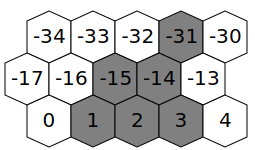
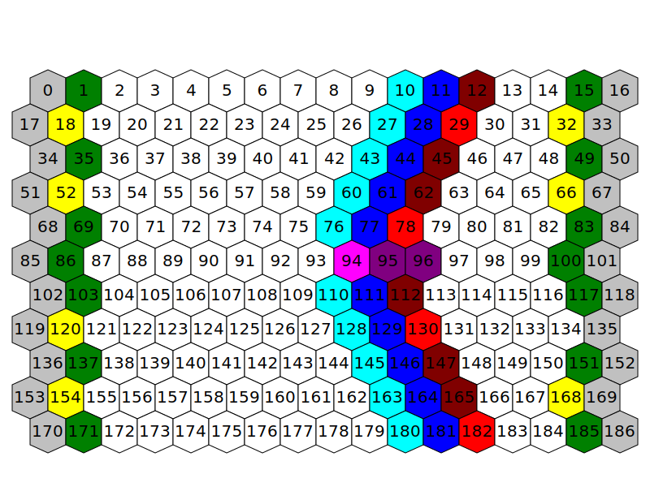

# Battle Obstacle Format

## Configuration reference

```json
	// List of terrains on which this obstacle can be used
	
	"allowedTerrains" : [
		"dirt",
		"sand",
		"asphalt", // terrain from mod, such form can only be used if mod has dependency on mod with such terrain
		"hota:wasteland", // terrain from mod, such form can be used even without dependency, entry will be ignored if such mod does not exists
	]
	
	// List of special battlefields on which this obstacle can be used
	"specialBattlefields" : []
	
	// If set to true, this obstacle will use absolute coordinates. Only one such obstacle can appear on the battlefield
	"absolute" : false
	
	// Width of an obstacle, in hexes
	"width" : 1
	
	// Height of an obstacle, in hexes
	"height" : 1
	
	// List of tiles blocked by an obstacles. See below for description
	"blockedTiles" : [ 0, 20, 50 ]
	
	// For absolute obstacle - image with static obstacle. For non-absolute - animation with an obstacle
	"animation" : "",
	
	// If set to true, obstacle will appear in front of units or other battlefield objects
	"foreground" : false
```

## Blocked tiles definition

How blocked tiles are defined depends on whether obstacle is `absolute` or not:

### Non-absolute obstacles

Non-absolute obstacles specify their coordinates relative to bottom-left corner of obstacle. If you wish to have obstacle that takes multiple rows, substracting 17 from hex number would block tile directly above bottom-left corner of your obstacle.

For example, obstacle that blocks tiles `[1, 2, 3, -14, -15, -31]` would result in following layout on the battlefield:



### Absolute obstacles

Absolute obstacles operate in absolute coordinates. Because of that, blocked tiles contains list of indexes of blocked tiles. For reference on tiles indexes see image below:


