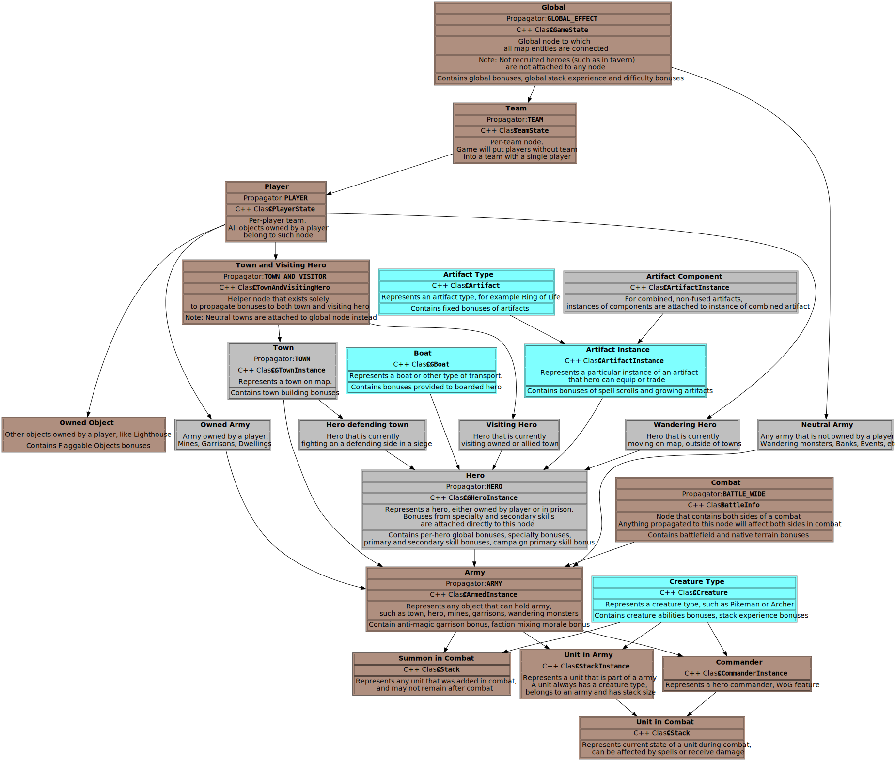

# Bonus System Guide

Bonuses are effects that can be given to various game entities. A lot of game mechanics in VCMI are implemented as bonuses. Most notably, but not limited to:

- All artifact effects
- All hero specialties
- All secondary skill effects
- All creature abilities
- Large number of spells
- Some of town building

While they don't provide same level of flexibility as ERM scripting from WoG, they are way easier to use and generally can be undestood by AI. List of supported effects is rather long, and covers all H3 mechanics, as well as some additions to support WoG creature abilities, HotA, and extensions requested by modders for VCMI.

## Basic Usage

See also: [List of Bonus Types](../Bonus/Bonus_Types.md)

### Bonuses without parameters

Some of the simplest bonuses don't require any parameters, so all you need to do is specify the bonus type:

```json
"bonuses" : {
	"noPenalty" : {
		"type" : "NO_DISTANCE_PENALTY"
	}
}
```

With this bonus, all ranged units in the army of the hero will not have a distance penalty when firing at distances larger than 10 hexes.

### Bonuses with value

Although bonuses without parameters do exist, the majority of bonuses require some configuration to suit your needs. For example:

```json
"bonuses" : {
	"scouting" : {
		"type" : "SIGHT_RADIUS",
		"val" : 3
	}
}
```

This bonus increases the hero's sight (scouting radius) by three adventure map tiles. If the hero has multiple sources of this bonus (such as a secondary skill, specialty or other artifacts) all the bonuses will stack and the hero's actual scouting range will be equal to the sum of the values of all the bonuses.

### Bonuses with subtypes

In addition to value, many bonuses support so-called 'subtypes', which allow you to specify exactly what should be affected by the bonus. For example:

```json
"bonuses" : {
	"noSandPenalty" : {
		"type" : "NO_TERRAIN_PENALTY",
		"subtype" : "sand"
	}
}
```

This bonus would eliminate the terrain penalty for your army when moving across sand terrain. Such subtypes can also be used to target objects added by mods without the need for additional bonus types in the game engine.

It is also possible, and in fact required for many bonuses, to use both subtypes with a value. In this scenario, only bonuses of the same type and subtype will stack:

```json
"bonuses" : {
	"attack" : {
		"type" : "PRIMARY_SKILL",
		"subtype" : "attack",
		"val" : 3
	}
}
```

### Bonuses with additional info

In addition to the `type`, `subtype` and `val` parameters, some bonuses may require or support an additional parameter called 'addInfo'. This is used by some bonuses to provide additional parameters that are not suitable for subtypes or values. For example:

```json
"bonuses" : {
	"upgradeMages" : {
		"type" : "SPECIAL_UPGRADE",
		"subtype" : "creature.mage",
		"addInfo" : "creature.enchanter"
	}
}
```

This bonus allows a hero with such an artefact to upgrade any mage in their army to an enchanter. For information on how to configure addInfo for a particular bonus, please refer to the [bonus types documentation](../Bonus/Bonus_Types.md).

## Advanced Usage

### Bonus Limiters

Generally, a bonus affects the entity that has the bonus, as well as all entities located 'below' (or 'inside') the affected entity.

For example, a bonus given to a player would affect all their heroes, towns and other owned objects, as well as their armies. However, this is undesirable in some scenarios. Heroes specialising in a specific creature, for instance, should only affect that creature and not their entire army. To support such a scenario, it is possible to use 'limiters', which enable bonuses to be applied only to certain affected entities:

```json
"specialty" : {
	"bonuses" : {
		"attack" : {
			"type" : "PRIMARY_SKILL",
			"subtype" : "primarySkill.attack"
			"val" : 3
			"limiters" : {
				// Type of limiter. See bonus system reference for details
				"type" : "CREATURE_TYPE_LIMITER", 
				// Type-specific parameters of the limiter
				"parameters" : [
					"pixie", // affected unit
					true // whether upgrades of affected unit should also be affected
				],
			}
		}
	}
}
```

This speciality increases the attack of all Pixies in the army by 3, but does not affect any other units or the hero himself. The game supports multiple other limiters for various other use cases. Please refer to the [bonus limiters documentation](../Bonus/Bonus_Limiters.md). for details.

### Bonus Propagators

In some cases, it is preferable to extend the effect of bonuses instead. A typical example is a creature ability that affects the entire battlefield. For example, Angels increase the morale of all units in their hero's army. However, simply giving the Angels a morale bonus would only affect the Angels themselves. In order to affect all units in the army, such an ability would require the bonus to be 'propagated' upwards (i.e. outside of the affected entity). For such scenarios, it is possible to use `propagator`:

```json
"abilities":
{
	"raisesMorale" : {
		"type" : "MORALE",
		"val" : 1,
		"propagator" : "HERO",
	}
}
```

This propagator extends the ability to all units in the hero's army, including the unit from which it originates. It is possible to propagate the bonus to most entities that form part of the bonus system. Please refer to the [bonus propagators documentation](../Bonus/Bonus_Propagators.md) for details.

### Bonus Updaters

Unlike propagators and limiters, updaters do not modify the entities affected by the bonus; instead, they modify the bonus itself. This is primarily used for H3 hero specialties, which are often scaled according to the level of the hero or the level of the affected unit. However, it is possible to use updaters in other areas if desired. Example:

```json
"specialty" : {
	"bonuses" : {
		"attack" : {
			"type" : "PRIMARY_SKILL",
			"subtype" : "primarySkill.attack",
			"val" : 1,
			"updater" : "TIMES_HERO_LEVEL"
		}
	}
}
```

This speciality increases the hero's attack by 1, multiplied by their level. For example, a level 20 hero would have an attack of +20.

Full list of supported bonus updaters can be found in [bonus updaters documentation](../Bonus/Bonus_Updaters.md)

### Only enemy side bonus

When creating a battle-wide bonus, you can use the 'BATTLE_WIDE' propagator to achieve the desired effect. Similarly, when creating a bonus that only affects allied units, use the 'HERO' propagator instead. However, due to the implementation details of the game's bonus system, bonuses that only affect the enemy side require specific configuration.

For example, to implement the morale-reducing ability of Ghost Dragons, you can use the following form:

```json
"abilities":
{
	"decreaseMorale" : {
		"type" : "MORALE",
		"val" : -1,
		"propagator": "BATTLE_WIDE",
		"propagationUpdater" : "BONUS_OWNER_UPDATER",
		"limiters" : [ "OPPOSITE_SIDE" ]
	}
}
```

As can be seen from the example, such bonuses must perform the following operations to work:

- The `BATTLE_WIDE` propagator extends the effect of the bonus to the entire battlefield.
- a `BONUS_OWNER_UPDATER` propagation updater – to indicate which side of the battlefield the bonus originates from
- an `OPPOSITE_SIDE` limiter to restrict the bonus to units (or heroes) belonging to the other side of the battle.

## Expert Usage

### Full Bonus Tree Layout

As mentioned in previous parts, the propagator allows bonuses to be propagated 'upwards', and bonuses only affect entities 'downwards' by default. Generally, it is clear which entities lie 'upwards' or 'downwards' – for example, creatures belong to an army, which belongs to a hero, who belongs to a player. Some cases might not be so clear, but you can consult the diagram below for help.

In this diagram, all entities connected to an entity above it are considered to be 'below', and vice versa:



### Combining updaters, propagators and limiters

When the game evaluates bonuses, the following order of operations is performed:

- If the bonus has a propagator, the game will attempt to look upwards through the bonus tree to find the entity to which the bonus should be propagated.
- If such an entity is found and the bonus has a propagation updater, the updater is executed using the context of the bonus source.
- The bonus is then moved to the entity to which it was propagated.
- The game then collects all bonuses located upwards from the entity for which the bonus is being evaluated. Each time a bonus with an updater passes through a node, the updater is applied to the bonus using the context of the entity it passes through, including the original entity that holds the bonus and the current entity.
- Once all bonuses have been collected, the game executes the limiter on each bonus and drops the bonus on a negative result.

As a result, there are some considerations you should bear in mind.

- The bonus updater is executed on every entity between the bonus source (or the bonus propagation target if a propagator is used). For example, a bonus propagated to a hero from a creature can use updaters that require either the hero or the creature.
- The bonus propagation updater, however, can only be used with updaters that require a creature as context in the case of a creature ability.
- A bonus limiter can only be used on the final entity through which the game accesses the bonus system for this particular bonus. For example, the SIGHT_RADIUS bonus is checked from the hero's perspective and can only be used with limiters that are valid for heroes.
