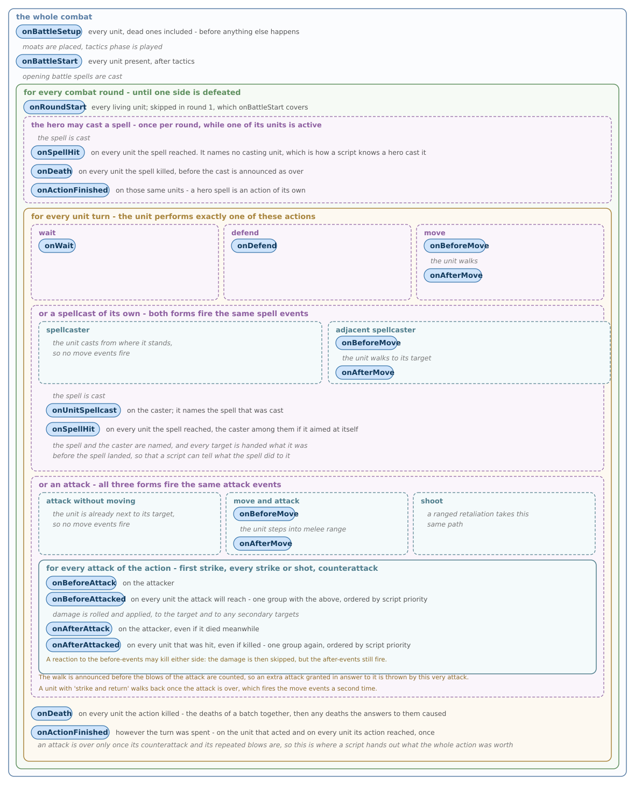

# Combat Event Scripts

Declared with `"implements" : "combatEvent"` in the [scripts](Script_Types.md) section of a mod. This script type reacts to events that happen to a unit during a battle, such as the unit waiting or being attacked. It is the way to implement effects that are not immediate - for example a spell that does something on the turn of every unit it affected.

## Attaching a script to a unit

A combat script runs on a unit that has the [COMBAT_EVENT_TRIGGER](../Bonus/Bonus_Types.md#combat_event_trigger) bonus referring to it. The bonus can be given like any other bonus - as a creature ability, from an artifact, from a secondary skill:

```json
"drainsLife" : {
    "type" : "COMBAT_EVENT_TRIGGER",
    "subtype" : "lifeDrain",
    "val" : 100
}
```

A spell grants the same bonus for its own duration through the built-in [attachCombatScript](../Entities_Format/Spell_Format.md#attach-combat-script) spell effect:

```json
"effects" : {
    "attachSpikes" : {
        "type" : "attachCombatScript",
        "eventScript" : "spikes",
        "eventValue" : 10,
        "eventParameters" : { "poison" : true }
    }
}
```

`eventParameters` reaches the script exactly as written, and is checked against the `schema` the script declares, so a spell attaching a script has to pass whatever that script requires. Nothing about the caster is added automatically - a script that needs to know the spell or its power has to be given it here.

## Description shown to the player

Every scripted ability shares the same `COMBAT_EVENT_TRIGGER` bonus type, so the text shown to the player comes from the script rather than from the bonus. Declare it as `description` on the script itself; `${val}` is replaced with the total value of every bonus granting this script and `${parameterName}` with the value the bonus passed in its parameters:

```json
"lifeDrain" : {
    "implements" : "combatEvent",
    "script" : "combat/lifeDrain",
    "patches" : [ ],
    "priority" : 0,
    "schema" : { "properties" : {}, "additionalProperties" : false },
    "description" : "{Life Drain}\nRestores health equal to ${val}% of damage dealt."
}
```

## Writing a script

Scripts extend `combatScript` and define a method only for the events they actually react to. An event whose method the script does not define is never handed to it:

```lua
local Base = require("combat/combatScript")
local Script = setmetatable({}, {__index = Base})
Script.__index = Script

function Script:onAfterAttacked(server, battle, unit, other)
    if other and other:isAlive() then
        server:damageUnit(battle, other, self.damage)
    end
end

return Script
```

## Assumptions and guarantees

VCMI guarantees the following:

- every event is delivered to every script attached to the unit it happened to that defines a method for it. An event the script does not define a method for is skipped
- the parameters stored in the bonus are read-only. A script that needs to remember something between events must store it itself, for example in a bonus of its own
- a script cannot cause further combat events. Everything it can do only changes battle state, and combat events are fired by unit actions
- no event is withheld from a script because the engine judged it pointless. Whether a counterattack, a repeated blow or the death of the bearer is a reason to do nothing is the script's own decision

## Event handlers

All handlers share the same signature and return nothing:

Signature: `function Script:on<Event>(server, battle, unit, other, payload)`

The parameters stored in the bonus initialize the script, so every property defined there is available as a field of `self` - for example `addInfo` of `{ "poison" : true }` is read as `self.poison`. The magnitude of the ability lives in the bonus value rather than in the parameters, and is read as `self.val`.

When several bonuses on the same unit grant the same script, each of them runs the script once, with its own `val` - the values are not summed into a single run. An ability whose effect is proportional to `val` therefore adds up on its own, while one that rolls a chance rolls once per bonus rather than once at the combined chance. When only the strongest source should apply instead, give every bonus granting the script the same [`stacking`](../Bonus_Format.md) group, the way core content does for fire shield.

Parameters:

- `server` - used to apply actual changes to the battle state. See [BattleServer](../Lua_Reference/BattleServer.md).
- `battle` - state of the battle this event happened in. See [Battle](../Lua_Reference/Battle.md).
- `unit` - the unit carrying the bonus, which this event happened to. See [Unit](../Lua_Reference/Unit.md).
- `other` - the unit on the opposite side of the event, such as the attacker. May be nil.
- `payload` - data about the attack that caused this event. Every event is handed one, and the fields an event does not fill keep their empty value, so a handler may read the fields it cares about without checking which event fired:
  - `ranged` - whether the attack was a shot
  - `isCounter` - whether the attack is a counterattack, either a first strike or a regular retaliation
  - `attackIndex` - position of this attack among those its own side makes in this action, so `0` for the first blow and `1` for the second of a double attack. A counterattack is its own side's attack `0`
  - `targets` - one entry per unit the attack reaches. Each holds the `unit` itself, the `damage` dealt to it, how many of its creatures were `killed`, the `damageBeforeDefense` this same blow would have dealt with the target's defences ignored, and the `healthBeforeAttack` the unit had left before the hit landed. **Before** the attack only `unit` and `healthBeforeAttack` are known - no damage has been rolled yet, so the other fields are zero

  A handler receives the whole target list rather than only its own entry, so it can see the full attack; it finds itself by comparing `target.unit` against `unit`.

Handlers:

- `onBeforeAttack` - called on the attacker before every one of its attacks, retaliations included
- `onBeforeAttacked` - called on every unit the attack is about to reach, not only its primary target, before every attack
- `onAfterAttack` - called on the attacker once its attack is resolved. The attacker may be dead by then, killed by a reaction to its own attack, so a script that must not act from beyond the grave checks `unit:isAlive()` itself
- `onAfterAttacked` - called on every unit the attack hit, once that attack is resolved. Fires even when the attack killed `unit`, so that a reflecting ability still answers a lethal blow; a script that should not react from a dead unit has to check for itself
- `onWait` - called when `unit` waits
- `onDefend` - called when `unit` defends
- `onBeforeMove` - called before `unit` starts movement
- `onAfterMove` - called after `unit` ends movement
- `onUnitSpellcast` - called after `unit` casts a spell
- `onBattleSetup` - called once for every unit as the battle is laid out, before tactics and before anything else happens to it. `other` is nil
- `onBattleStart` - called once for every unit present when the battle starts, after tactics are over and before any opening spell is cast. `other` is nil
- `onRoundStart` - called for every alive unit at the start of each round after the first. The first round is covered by `onBattleStart`. `other` is nil



The attack events always fire in this order, once per attack:

```text
onBeforeAttack   (attacker)  \  one group, ordered by priority
onBeforeAttacked (each unit about to be hit)  /
      ... damage is rolled and applied, the combat log is written ...
onAfterAttack    (attacker)  \  one group, ordered by priority
onAfterAttacked  (each unit that was hit)  /
```

The attacker and the units it hits react as one ordered group, so `priority` alone decides whether a script runs before or after another - which side of the attack it sits on does not matter. That is what lets life drain (priority 0) heal before a fire shield (priority 50) burns the attacker down.

None of them is withheld: a counterattack, the second blow of a double attack and an attack whose bearer dies mid-resolution all deliver the full sequence. Deciding whether to act is left to the script, because the right answer differs per ability - a fire shield must burn its killer while dying, and a death stare must not petrify anyone once its bearer is gone.

## Built-in scripts

Every combat event script declares a `priority` in its `scripts` entry. Scripts reacting to the same event run from lowest priority to highest, and `0` is the usual answer. It is required rather than defaulted because bonus order is otherwise alphabetical by ability name, which would let a mod decide what runs first by renaming an ability.

Four of the scripts below exist only so that content declaring the bonus they replaced keeps working. They reproduce the H3 and WoG behaviour they were converted from, quirks included, and will not grow options beyond what that behaviour needs. A mod that wants an ability of that kind should ship its own script rather than try to configure these.

### lifeDrain

Restores part of the damage its bearer dealt back to it as health, resurrecting fallen creatures of the stack. Only damage dealt to living targets counts.

Priority 0, so the drain heals before anything that answers the attack can kill the attacker.

Parameters:

- `val` - share of the dealt damage restored to the attacker, in percent

### fireShield

Burns whoever strikes its bearer in melee for a share of the damage that strike could have dealt. An attacker immune to fire takes nothing, and neither does one that an area attack reached without closing with the bearer.

Priority 50.

Parameters:

- `val` - share of the reflected damage, in percent

### deathStare

Kills creatures of the attacked stack outright, each creature of the bearer's stack rolling its own chance. At most the share of the stack that could have rolled it dies.

Priority 100, so it lands after anything that may have killed the bearer, which stops the gaze.

Parameters:

- `val` - chance for each creature to kill one, in percent
- `situation` - when the ability applies: `"melee"`, `"ranged"`, `"rangedDistancePenalty"`, `"rangedWallPenalty"` or `"rangedDistanceAndWallPenalty"`
- `spell` - spell cast to kill them, which decides the animation, the immunities and the wording of the combat log. Defaults to death stare

The script decides how many die in `killsIn`, which answers nil when the attack is not one the ability applies to. A patch overriding that method is how a mod adds a situation of its own, and `combat/deathStareCommander` - the patch core stacks over this script - is the worked example:

```lua
function Script:killsIn(server, battle, unit, other, payload)
    if self.situation ~= "commander" then
        return Base.killsIn(self, server, battle, unit, other, payload)
    end

    return <however many this ability kills>
end
```

`"commander"` is DEPRECATED and comes from that patch rather than from the script. It exists so that the commander skill converted from the `DEATH_STARE` bonus keeps working, and `val` means something else under it - kills before the level ratio of the two stacks is applied. Write a patch rather than expecting more situations to be added here.

### enchanted

Keeps a spell permanently applied to its bearer, or to its whole side, by re-applying it at the start of every round.

Parameters:

- `spell` - spell whose effects are applied
- `level` - mastery level the effects are applied at
- `massive` - true to affect every allied unit instead of only the bearer
- `duration` - how many turns the effects last. Defaults to 50, long enough for the effect to accumulate rather than expire between rounds

### summonGuardians

DEPRECATED, transition only - see the note at the start of this section.

Surrounds its bearer with summoned guardians when the battle starts. Where the guardians go is the H3 placement, including its special cases for units starting against their own edge of the battlefield.

Parameters:

- `creature` - creature to summon as guardian
- `val` - size of each guardian stack, in percent of the guarded stack

### transmutation

DEPRECATED, transition only - see the note at the start of this section.

Replaces the attacked stack with a stack of another creature, as the WoG werewolf ability does. A unit with [TRANSMUTATION_IMMUNITY](../Bonus/Bonus_Types.md#transmutation_immunity) is not affected, and neither is a non-living one.

Priority 300.

Parameters:

- `val` - percentage chance to trigger on each attack
- `creature` - creature the victim turns into. Defaults to the attacker's own creature
- `transmuteBy` - `"health"` keeps the total health of the victim, `"count"` keeps its creature count

### soulSteal

DEPRECATED, transition only - see the note at the start of this section.

Raises its bearer's stack for every enemy creature it killed, beyond the stack's original size. Only kills among living targets count.

Parameters:

- `val` - creatures gained for each killed enemy creature
- `permanent` - true to keep the gained creatures after the battle

### destruction

DEPRECATED, transition only - see the note at the start of this section.

Kills creatures of the attacked stack outright, on top of the damage the attack itself dealt.

Priority 400.

Parameters:

- `val` - percentage chance to trigger on each attack
- `killBy` - `"percentage"` kills a share of the victim's stack, `"count"` kills a fixed number
- `amount` - the share, or the number of creatures, depending on `killBy`
