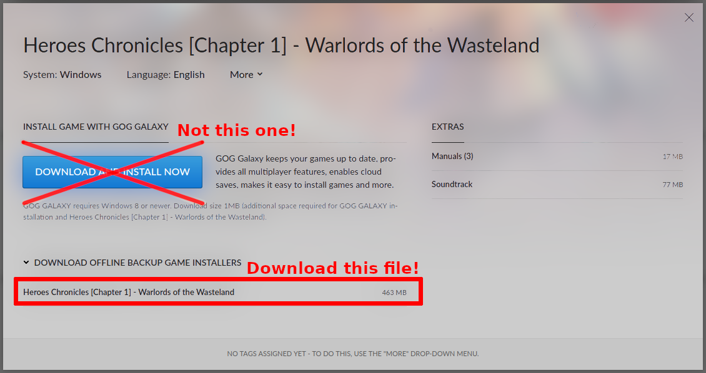

# Heroes Chronicles

It also possible to play the Heroes Chronicles with VCMI. You still need a completly installed VCMI (with heroes 3 sod / complete files).

You also need Heroes Chronicles from [gog.com](https://www.gog.com/en/game/heroes_chronicles_all_chapters). You need to download the offline installer. CD installations are not supported yet.

gog.com download page:

For each chapter you will need a seperate exe file to install (if you want to install all, you'll need 8 exe files).

There is also an "All in one" installer as alternative. Just login into your gog account and open this url: [All in one installer](https://www.gog.com/downloads/heroes_chronicles_all_chapters/en1installer0)

You can use the "Install file" button in the launcher to select the downloaded exe files. This process can take a while (especially on mobile platforms) and need some temporary free space.

After that you can select Heroes Chronicles from Campaign selection menu (button or custom campaign).
