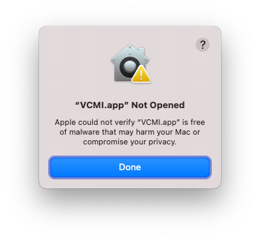
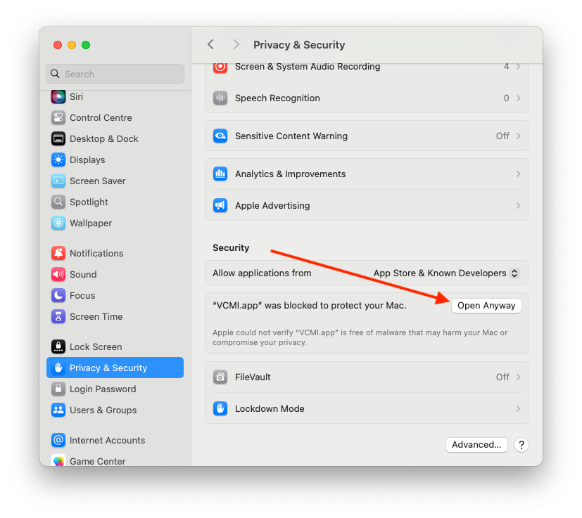
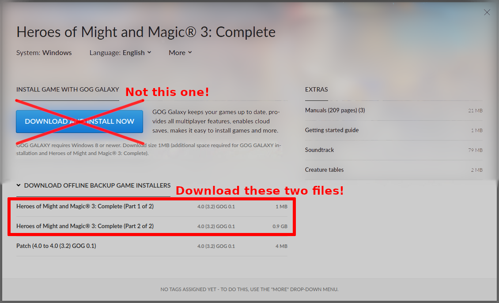

# Installation macOS

## Step 1: Download and install VCMI

- The latest release (recommended):
  - manually: <https://github.com/vcmi/vcmi/releases/latest>
  - via Homebrew: `brew install --cask --no-quarantine vcmi/vcmi/vcmi`
- Daily builds (might be unstable)
  - [Intel (x86_64) builds](https://builds.vcmi.download/branch/develop/macos-arm/)
  - [Apple Silicon (arm64) builds](https://builds.vcmi.download/branch/develop/macos-intel/)

If the app doesn't open, right-click the app bundle - select *Open* menu item - press *Open* button. On macOS 15 Sequoia and later there will be no *Open* button, instead you'll see the following dialog:

To fix it, go to System Settings - Privacy & Security tab - scroll down and press the *Open Anyway* button (marked with an arrow on the image below). After that confirm your action and enter your administrator password.

## Step 2: Installing Heroes III data files

### Step 2.a: Installing data files with GOG offline installer

If you bought HoMM3 on [GOG](https://www.gog.com/de/game/heroes_of_might_and_magic_3_complete_edition), you can download the files directly from the browser and install them in the launcher. Select the .bin file first, then the .exe file. This may take a few seconds. Please be patient.

gog.com download page:

### Step 2.b: Installing by the classic way

1. Find a way to unpack Windows Heroes III or GOG installer. For example, use `vcmibuilder` script inside app bundle or install the game with [CrossOver](https://www.codeweavers.com/crossover) or [Kegworks](https://github.com/Kegworks-App/Kegworks).
2. Place or symlink **Data**, **Maps** and **Mp3** directories from Heroes III to:`~/Library/Application\ Support/vcmi/`
